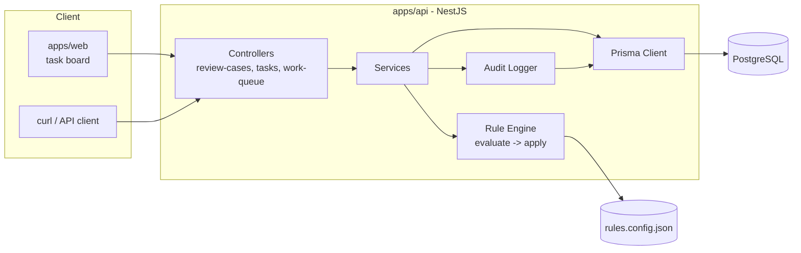
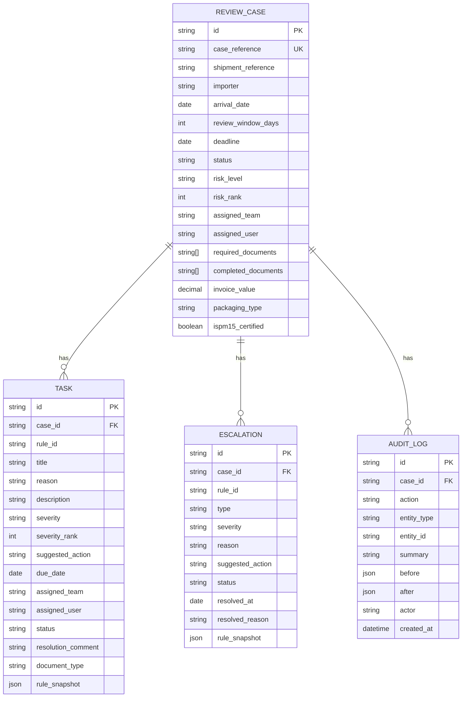
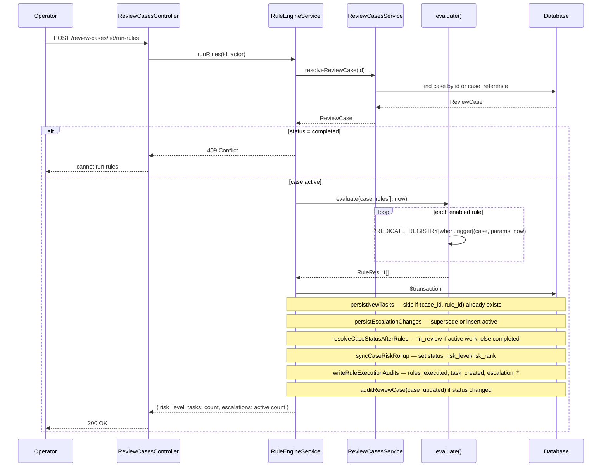
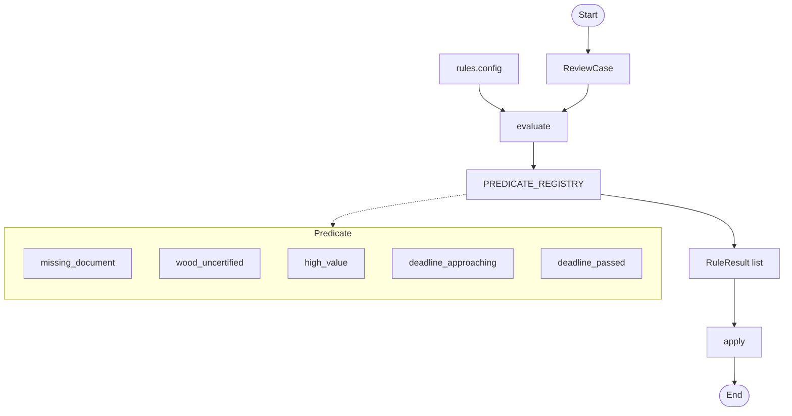
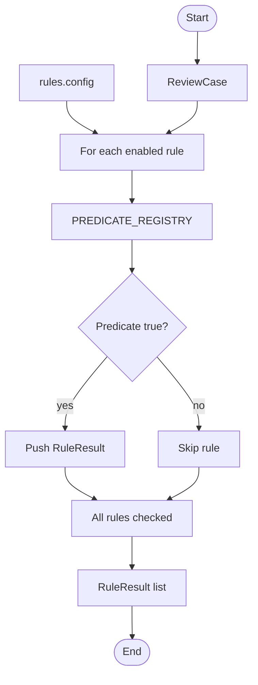
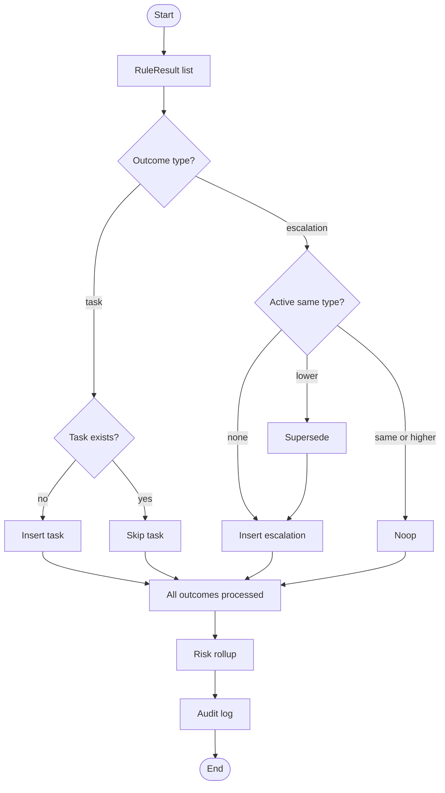
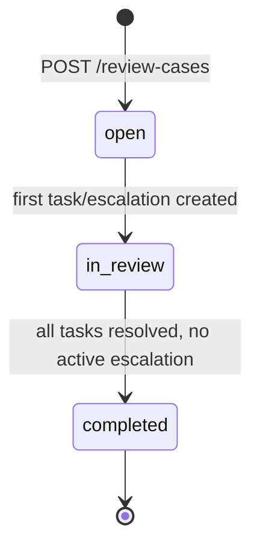
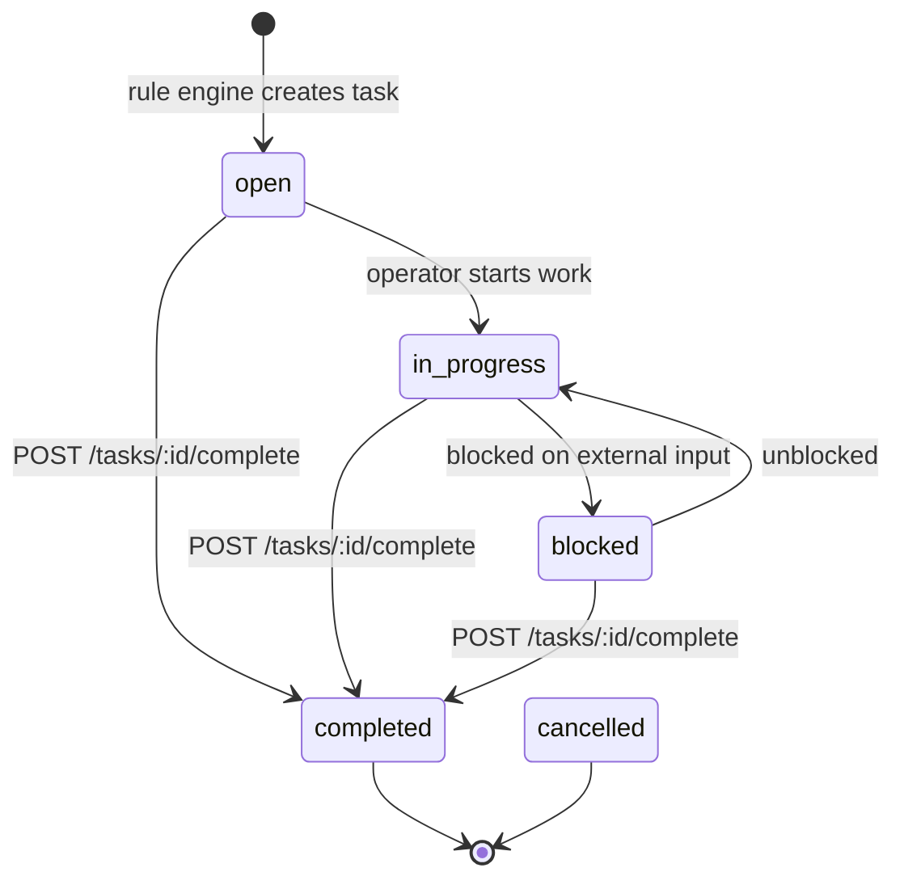
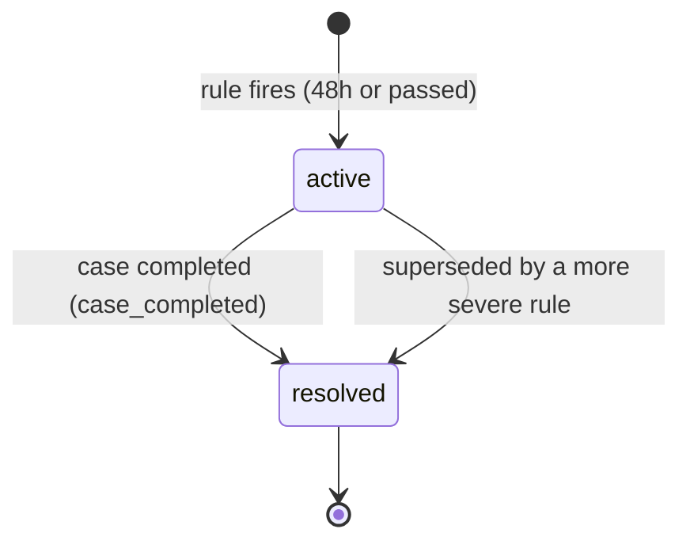

# System Design

Companion to [README.md](../README.md) and [ASSUMPTIONS.md](ASSUMPTIONS.md). This
file covers component layout, data model (ERD), rule-engine flow, and state machines.

## 1. Component diagram



## 2. Data model (ERD)



Notes:

- `TASK(case_id, rule_id)` is unique — one task per rule per case, so re-running rules
  never duplicates a task (idempotent).
- `ESCALATION` has a partial unique index on `(case_id, type) WHERE status = 'active'` —
  at most one active escalation per type per case.
- `risk_rank` / `severity_rank` are stored, not computed at query time, so `ORDER BY`
  can use an index instead of sorting in application code.

## 3. Rule engine flow

**Rule** — one entry in `rules.config.json`. Defines _when_ to fire (`when`) and _what_ to create (`task` or `escalation`).

```typescript
type RuleTrigger =
	| 'missing_document'
	| 'wood_uncertified'
	| 'high_value'
	| 'deadline_approaching'
	| 'deadline_passed';

interface RuleDefinition {
	ruleId: string;
	version: number;
	enabled: boolean;
	reason: string;
	when: {
		trigger: RuleTrigger;
		params: Record<string, unknown>;
	};
	task?: RuleTaskOutcome; // task rules — 4 rules
	escalation?: RuleEscalationOutcome; // escalation rules — 2 rules
}
```

Example — task rule (`R-DOC-TRANSPORT`):

```json
{
	"ruleId": "R-DOC-TRANSPORT",
	"version": 1,
	"enabled": true,
	"reason": "transport_document is required but not completed",
	"when": {
		"trigger": "missing_document",
		"params": { "documentType": "transport_document" }
	},
	"task": {
		"severity": "critical",
		"title": "Missing transport document",
		"description": "The transport document (Bill of Lading / AWB) is required...",
		"suggestedAction": "Request transport document from partner",
		"assignedTeam": "trade_operations"
	}
}
```

Example — escalation rule (`R-DEADLINE-48H`):

```json
{
	"ruleId": "R-DEADLINE-48H",
	"version": 1,
	"enabled": true,
	"reason": "review deadline is within 48 hours",
	"when": {
		"trigger": "deadline_approaching",
		"params": { "hoursThreshold": 48 }
	},
	"escalation": {
		"type": "deadline",
		"severity": "high",
		"reason": "Review deadline within 48 hours",
		"suggestedAction": "Escalate to shift manager"
	}
}
```

### 3.1 Sequence



### 3.2 Pipeline

**Predicate** — a function that answers one question: _should this rule fire for this case?_
Returns `true` or `false`. No DB access.

```typescript
type Predicate = (
	reviewCase: ReviewCase,
	params: Record<string, unknown>, // from rules.config → when.params
	now?: Date,
) => boolean;
```

- **`reviewCase`** — case data loaded from DB (docs, packaging, invoice, deadline, …).
- **`params`** — per-rule settings from config. Same trigger, different params = different rules.
  e.g. `missing_document` uses `{ documentType: "transport_document" }`; `high_value` uses `{ threshold: 100000 }`.
- **`now`** — current time, used by deadline predicates.



### 3.3 Evaluation



### 3.4 Apply



### 3.5 Rules

7 rules, keyed by `when.trigger`:

| Trigger                | Rules                                                | Outcome                       |
| ---------------------- | ---------------------------------------------------- | ----------------------------- |
| `missing_document`     | commercial invoice, packing list, transport document | task (critical/high/critical) |
| `wood_uncertified`     | wooden packaging without ISPM-15 cert                | task (high)                   |
| `high_value`           | invoice value above threshold                        | task (management review)      |
| `deadline_approaching` | within 48h of deadline                               | escalation (high)             |
| `deadline_passed`      | past deadline                                        | escalation (critical)         |

## 4. State machines

### 4.1 Case status



`escalated` is **not** a state — it's derived from `EXISTS(active escalation)` and can be
true while status is `open` or `in_review`.

### 4.2 Task status



Completing a task with a `document_type` also appends it to the case's
`completed_documents`, so a later `run-rules` call won't recreate the same task.

### 4.3 Escalation lifecycle (resolve-then-insert)



Only one `active` escalation per `type` per case at a time. When `deadline_passed` fires
while a `deadline_approaching` escalation is still active, the old row is resolved with
`resolved_reason = "superseded"` and a new `active` row is inserted — history is never
overwritten, only appended.

