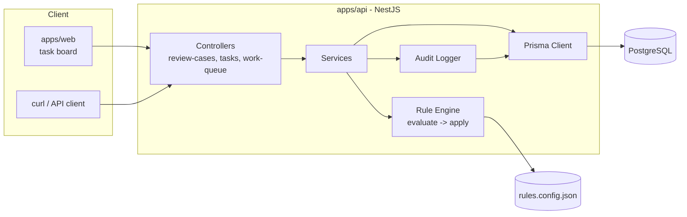
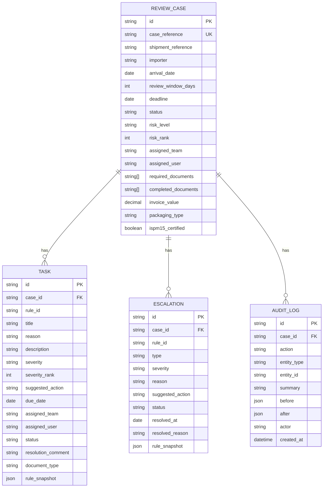
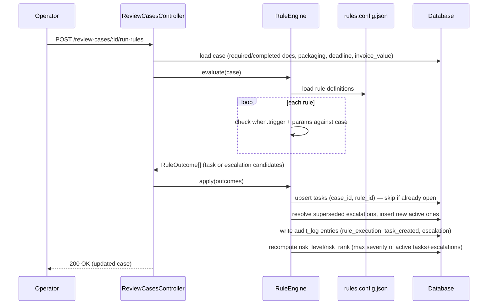
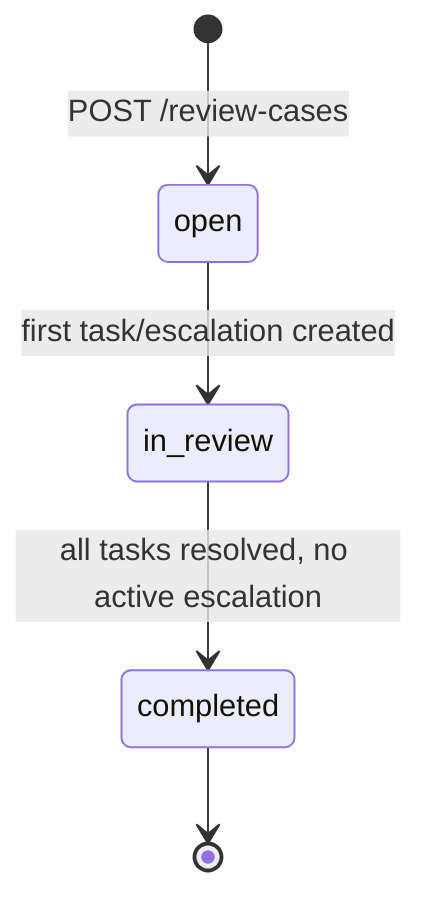
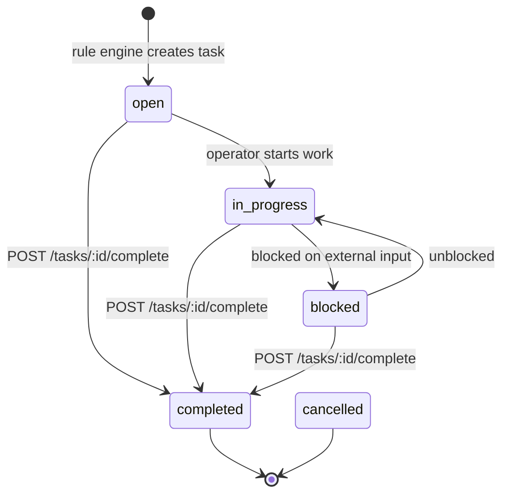
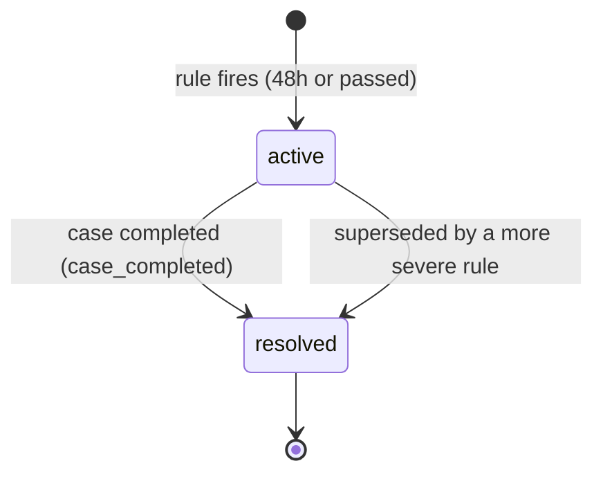

# System Design

Companion to [README.md](../README.md) and [ASSUMPTIONS.md](ASSUMPTIONS.md). This
file covers component layout, data model (ERD), rule-engine flow, and state machines.

## 1. Component diagram



## 2. Data model (ERD)



Notes:

- `TASK(case_id, rule_id)` is unique — one task per rule per case, so re-running rules
  never duplicates a task (idempotent).
- `ESCALATION` has a partial unique index on `(case_id, type) WHERE status = 'active'` —
  at most one active escalation per type per case.
- `risk_rank` / `severity_rank` are stored, not computed at query time, so `ORDER BY`
  can use an index instead of sorting in application code.

## 3. Rule engine flow



7 rules, keyed by `when.trigger`:

| Trigger                | Rules                                                | Outcome                       |
| ---------------------- | ---------------------------------------------------- | ----------------------------- |
| `missing_document`     | commercial invoice, packing list, transport document | task (critical/high/critical) |
| `wood_uncertified`     | wooden packaging without ISPM-15 cert                | task (high)                   |
| `high_value`           | invoice value above threshold                        | task (management review)      |
| `deadline_approaching` | within 48h of deadline                               | escalation (high)             |
| `deadline_passed`      | past deadline                                        | escalation (critical)         |

## 4. State machines

### 4.1 Case status



`escalated` is **not** a state — it's derived from `EXISTS(active escalation)` and can be
true while status is `open` or `in_review`.

### 4.2 Task status



Completing a task with a `document_type` also appends it to the case's
`completed_documents`, so a later `run-rules` call won't recreate the same task.

### 4.3 Escalation lifecycle (resolve-then-insert)



Only one `active` escalation per `type` per case at a time. When `deadline_passed` fires
while a `deadline_approaching` escalation is still active, the old row is resolved with
`resolved_reason = "superseded"` and a new `active` row is inserted — history is never
overwritten, only appended.

## 5. Risk roll-up

`RiskLevel` (case-wide) = highest `Severity` among the case's active tasks + active
escalations, using the shared rank:

```
critical = 40, high = 30, medium = 20, low = 10
```

If no active tasks/escalations remain, `risk_level` falls back to `low`.
